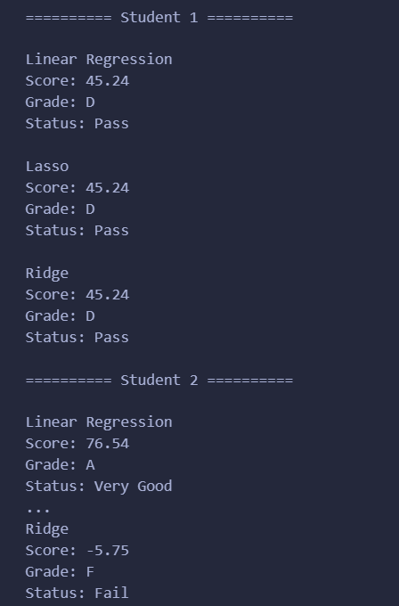
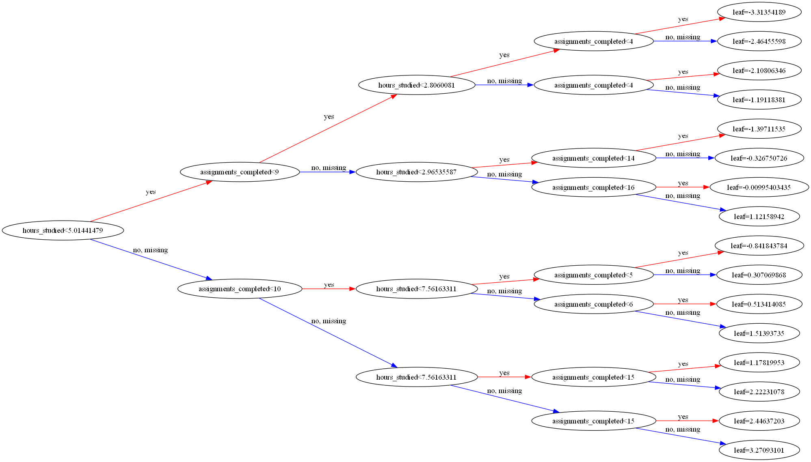

<h1 align="center">Student Performance(Score Prediction and Visualization) Prediction Using Machine Learning</h1>

Glowlogics Project 1

Samay Shetty

 

 

#### Process:
### Data Collecting

- We must collect the data we need according to our needs.
- Depending on the target variable (dependent variable/ our predictor variable/ y) we need to collect other data (characteristics/ independent variables/ Features).

### Data Preprocessing 

- After collecting the data we need to clean it, 
  ##### _find missing data and fill them_
  ##### _Drop duplicate data_
  ##### _Turn categorical data into numerical or Boolean_
  ##### _Rename columns for easily understand_
  ##### _Separate target value and features_
  
- We can use Encoding method or dummy method for convert categorical data into numerical or boolean.

### Data Analysis

- We can analyze the relationships between the target and the features using plots, graphs, etc.
- We can identify the relationship through the following sample examples.
  
 

  

  

  

  

  

  

 

### Split the Data into training and testing

- We want seperate data set into training and testing.
- Traing data is used for train model and tesing data for find model accuracy

 
  
### Evaluate the Model

- Then we can train linear regression model using traning data

 

### Check model performance

- We are used testing data set for this proccess
- We can use mean squared error, mean absolute error and R2 score for check performance
- MSE measures the average of the squares of the errors—that is, the average squared difference between the actual and predicted values
- Lower MSE values indicate a better fit. However, since MSE is in squared units of the response variable, it can be harder to interpret directly
- R², or the coefficient of determination, indicates the proportion of the variance in the dependent variable that is predictable from the independent variable
- R² ranges from 0 to 1. An R² of 1 indicates that the model perfectly explains the variability of the response data around its mean, while an R² of 0 indicates that the model does not 
  explain any of the variability.
- We can check these thing between trained and test data
- Also we can use recidual plot for predict trained model performance

 
   

  

 

### Fine-tune the Model

- Fine-tuning a Linear Regression (LR) model involves optimizing the model parameters and improving its performance by making adjustments based on the evaluation of its results. Here 
  are some steps and techniques for fine-tuning a Linear Regression model

#### Feature Engineering

- Feature Selection: Choose the most relevant features for the model. Techniques include correlation analysis, recursive feature elimination, and using algorithms like Lasso that perform feature selection.
- We can use recursive feature elemination for this technique

 

#### Regularization

- Apply techniques to prevent overfitting by adding a penalty to the model's complexity  
  1. Ridge Regression: Adds an L2 penalty to the loss function. 
  2. Lasso Regression: Adds an L1 penalty to the loss function. 
  3. Elastic Net: Combines both L1 and L2 penalties.  

 

#### Hyperparameter optimization

- Use techniques such as Grid Search or Random Search to find the best hyperparameters for your model. These can be used to tune regularization parameters, polynomial degrees, etc

 

#### Cross-Validation

- Implement cross-validation techniques (like k-fold cross-validation) to ensure that the model generalizes well to unseen data.

#### Prediction

 

 #### Prediction Visualization
  

 #### Students in Risk are segregatted
  
